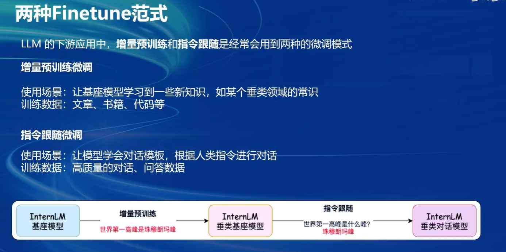
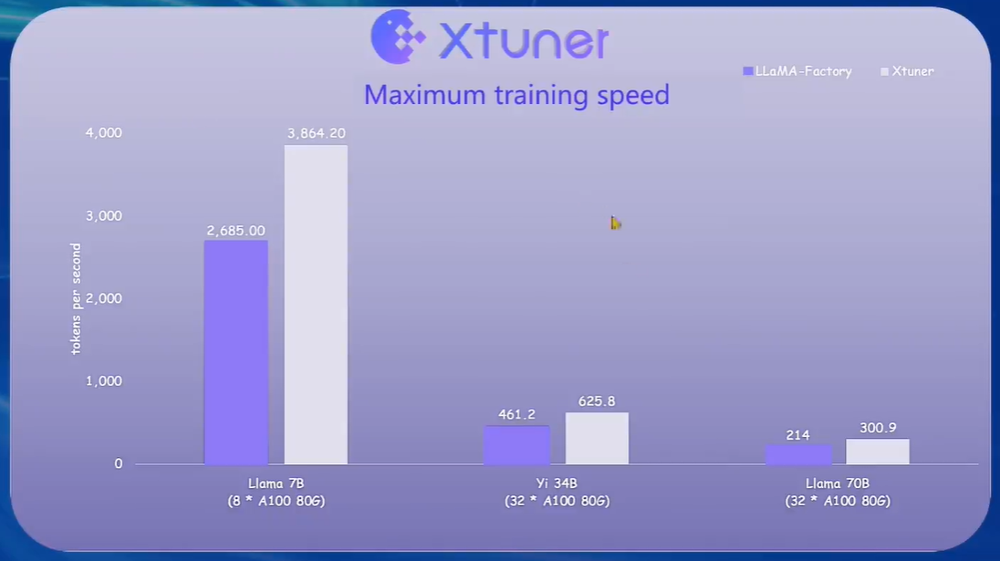
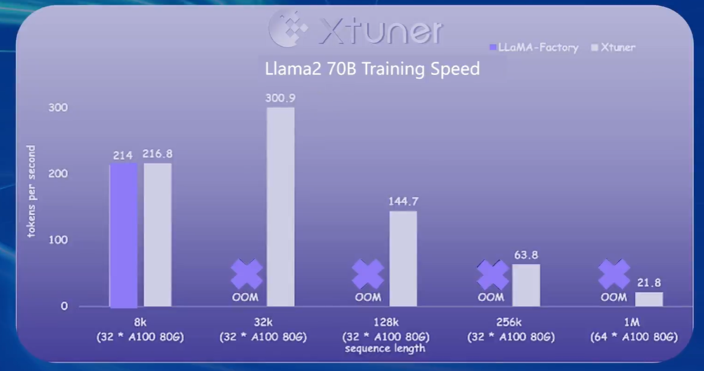

## XTuner 微调 LLM

- 为什么要进行领域内的微调

  大型预训练模型通常在大规模的通用语料库上进行预训练，以学习通用的语言表示和语言模式。然而，在特定的任务或领域中，这些通用模型可能无法直接适用，因为它们并没有针对特定任务或领域进行过深度训练。

  领域内微调的主要目的是将通用的预训练模型进一步调整，以适应特定任务或领域的需求。这种微调可以使模型更好地理解和处理特定领域的文本，提高模型在该领域任务上的性能和效果。

- 两种finetune范式
  
  
- XTuner

  XTuner 是一个高效、灵活、全能的轻量化大模型微调工具库。

  - 支持多种大语言模型
    包括但不限于 InternLM、Mixtral-8x7B、Llama2、ChatGLM、Qwen、Baichuan。我们也会实时根据最新动态，快速支持一些最新且强的基座模型。**得益于 OpenMMLab 中之前专门设计的 MMEngine Config，其实用户也很容易通过配置重写-类继承的方式快速接入任何一个 LLM 模型**。我们之前很多新模型的 SFT 验证都是热心的社区用户帮忙做的，是方便快捷的。
  - 支持[QLoRA](https://link.zhihu.com/?target=http%3A//arxiv.org/abs/2305.14314)、[LoRA](https://link.zhihu.com/?target=http%3A//arxiv.org/abs/2106.09685)、全量参数微调等多种微调算法，支撑用户根据具体需求作出最优选择
  - 高效训练
    - 自动分发高性能算子（如 FlashAttention、Triton kernels 等）以加速训练吞吐
    - 兼容 DeepSpeed ，轻松应用各种 ZeRO 训练优化策略
  - 与LLaMa-Factory对比
    
    