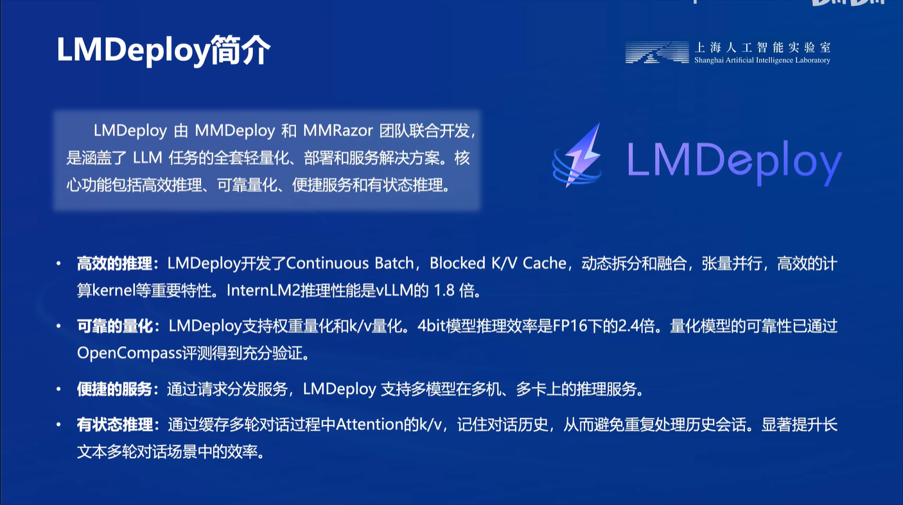
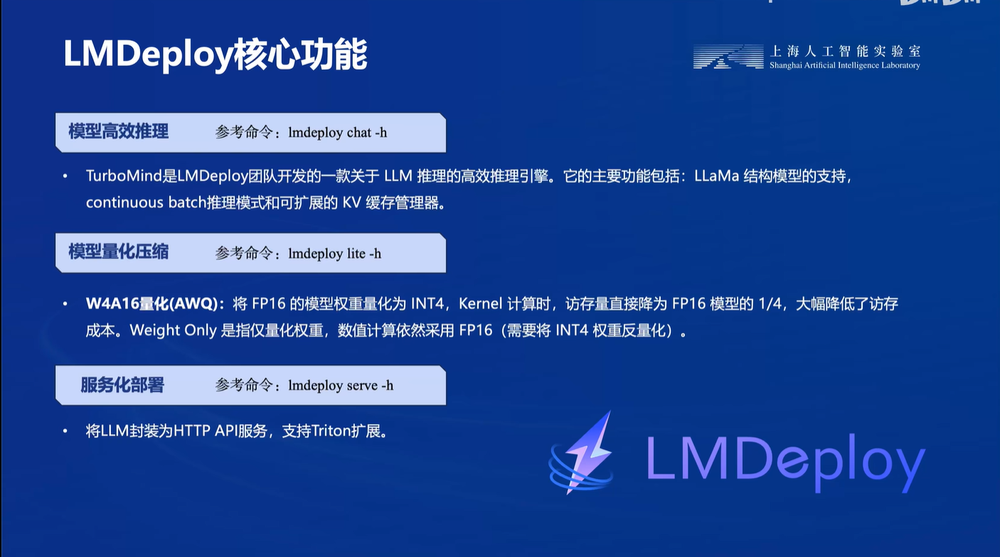
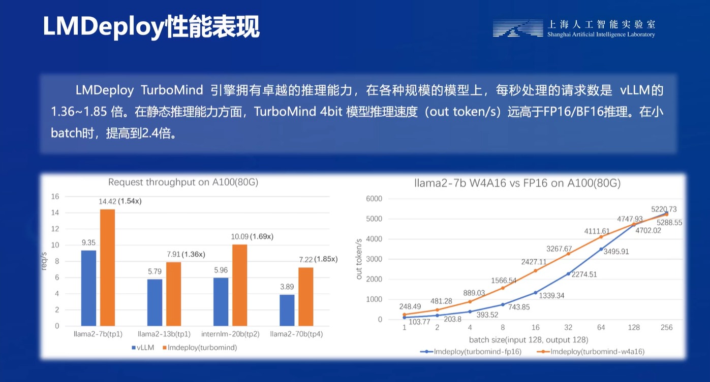

## 大模型部署背景
- 模型部署是指将机器学习或深度学习模型从开发环境成功转移到生产环境，并使其能够在实际应用中发挥作用的过程。这个过程涉及将训练好的模型嵌入到实际的软件系统或服务中，以便对输入数据进行预测、分类、生成等操作。
- 模型部署面临着各种各样的挑战，其中一些主要的挑战包括：
  - 计算量巨大。随着深度学习模型的发展和应用，研究人员和工程师们开始构建越来越复杂的模型，以解决更具挑战性的任务。这些大型模型通常拥有数十亿甚至数百亿个参数，其计算需求巨大，包括训练和推理阶段。
  - 内存开销大。大型模型通常包含数十亿甚至数百亿个参数，这些参数需要大量的内存来存储。在部署阶段，需要将这些参数加载到内存中，以便模型能够进行推理。这会导致内存开销巨大，特别是在同时部署多个大型模型或在内存资源有限的情况下。在模型推理过程中，还会产生大量的中间计算结果，这些结果也需要占用内存。特别是对于深层神经网络模型，每一层的计算结果都需要在内存中保存，以便传递给下一层。如果模型非常深或者输入数据非常大，那么中间计算结果的内存开销可能会非常高。
  - 访存瓶颈。
    - 大型模型通常需要处理大规模的数据集，这意味着在推理过程中需要频繁地从内存中读取大量的数据。如果内存带宽不足以满足模型对数据的需求，就会导致访存瓶颈。
    - 深度学习模型的推理过程中存在复杂的数据访问模式，包括随机访问、连续访问、跨层访问等。这些不规则的访问模式可能导致内存访问效率低下，增加了访存瓶颈的发生概率。
    - 大型模型的参数和中间计算结果通常无法完全放入缓存中，因此需要频繁地从内存中读取数据。如果缓存命中率低，即大部分数据都无法从缓存中获取，就会导致频繁的内存访问操作，增加了访存瓶颈的发生。
    - 内存带宽是指在单位时间内从内存中读取或写入数据的速率。如果模型推理过程中对内存带宽的需求超过了硬件设备提供的带宽，就会出现内存带宽限制，导致访存瓶颈的发生。
  - 动态请求。
    - 大型模型在处理动态请求时，需要满足一定的实时性要求，即在有限的时间内完成请求的处理并返回结果。这对模型的推理速度、系统的响应速度等方面提出了较高的要求。
    -  动态请求的到来可能会导致系统资源的动态分配和调度，包括计算资源、存储资源、网络带宽等。如何有效地管理和调度这些资源，以满足动态请求的处理需求，是一个挑战。
    -  在面对大量的动态请求时，如何实现负载均衡，即合理地分配请求到不同的计算节点或者服务实例上，以避免单点故障和资源过载，是一个挑战。
    -  随着动态请求的变化，可能需要对模型进行更新或者迭代，以适应新的请求类型或者环境变化。如何实现模型的热更新，并且在更新过程中保证系统的稳定性和可用性，是一个挑战。
    -  在处理动态请求时，系统可能会遇到各种异常情况，如网络故障、服务崩溃等。如何设计容错机制和实现自动恢复功能，以保证系统的稳定性和可靠性，是一个挑战。
## 大模型部署方法
- 模型剪枝
  - 结构化剪枝。 结构剪枝是指通过去除模型中的某些结构，如神经网络中的某些层或者通道，从而减少模型的结构复杂度。常见的结构剪枝方法包括按照层级进行剪枝（Layer-wise Pruning）、按照通道进行剪枝（Channel Pruning）等。在进行结构剪枝时，通常需要结合模型结构的特点和任务需求来确定剪枝策略。
  - 非结构化剪枝。与结构化剪枝相对应。在非结构化剪枝中，剪枝操作并不限制于特定的结构，而是针对模型中的单个参数进行操作，即根据某种规则或标准来选择要剪枝的参数，而不考虑其所在的层或通道。
- 知识蒸馏。知识蒸馏（Knowledge Distillation）是一种模型压缩技术，旨在将一个复杂的模型（通常称为教师模型）的知识转移给一个简化的模型（通常称为学生模型），从而减少模型的计算和存储开销，同时保持模型的性能。知识蒸馏的核心思想是通过在训练过程中引入额外的损失函数，利用教师模型的输出作为监督信号来指导学生模型的训练。
- 模型量化。模型量化（Model Quantization）是一种用于减少深度学习模型计算和存储开销的技术。它通过将模型的权重和激活值映射到更低的位数表示来实现，从而减少了模型在内存中的存储需求以及在推理过程中的计算量。
## LMDeploy

