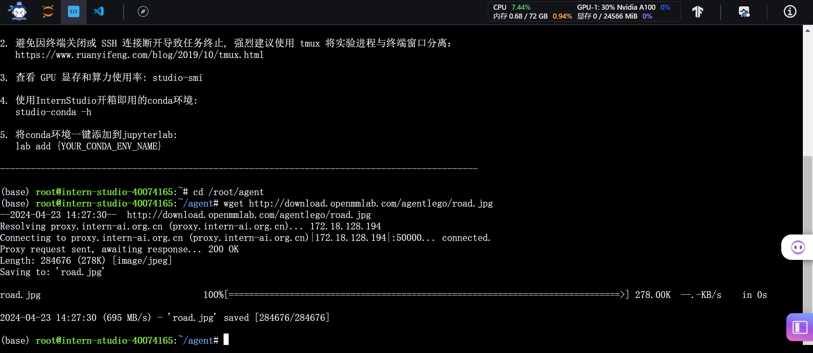

- 创建开发机和conda环境
  
- 安装 Lagent,AgentLego和其他依赖
  
- 准备 Tutorial
  
## Lagent Web Demo
- 使用 LMDeploy 部署
  
- 启动并使用 Lagent Web Demo
  
  
  
## 直接使用 AgentLego
- 首先下载 demo 文件：
  
-  然后通过 `touch /root/agent/direct_use.py`（大小写敏感）的方式在 /root/agent 目录下新建 direct_use.py 以直接使用目标检测工具
  
-  进行推理并查看输出
  
  
  