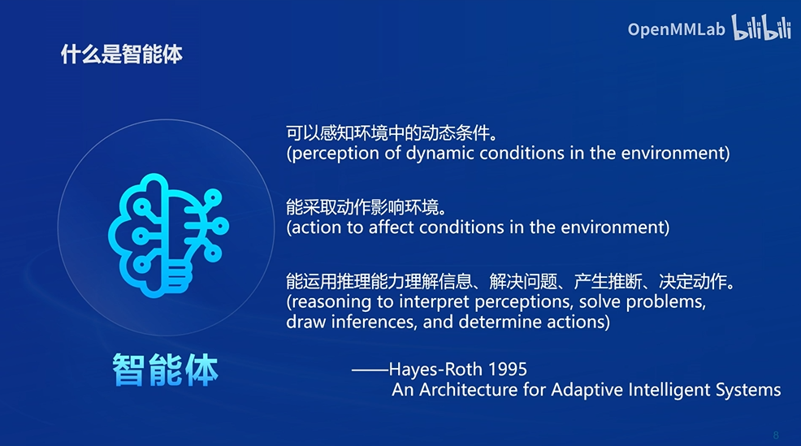
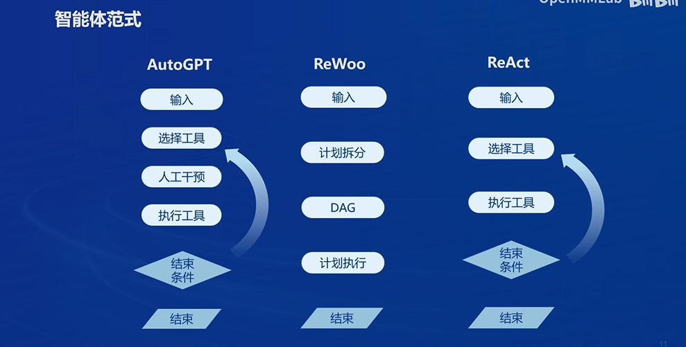
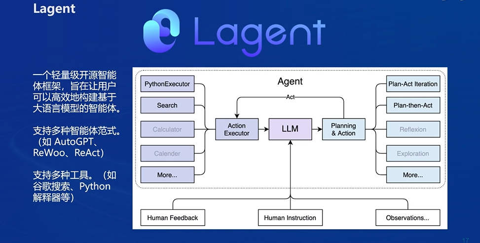
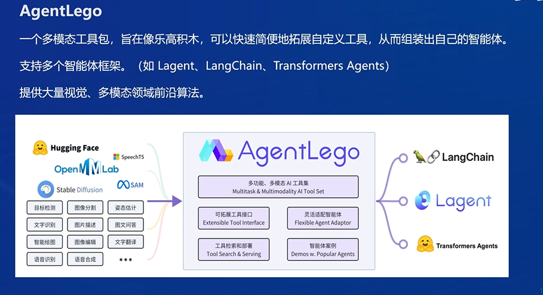

## 为什么要有智能体

- 大语言模型的局限性
  1. **幻觉（Illusion）：** 大语言模型可能会产生幻觉，即生成的文本严重脱离现实，产生虚假信息。
  2. **时效性（Timeliness）：** 大语言模型在生成文本时可能不具备时效性，即生成的文本可能不及时或不适用于当前的语境或情境。这是因为模型的训练数据通常是历史数据，而模型无法自动更新以反映最新的信息或事件。因此，在某些情况下，生成的文本可能已经过时或不符合当前的实际情况。
  3. **可靠性（Reliability）：** 大语言模型的可靠性指的是其生成的文本是否准确、可信和可靠。尽管大语言模型在大多数情况下可以生成合理的文本，但它们仍然可能出现错误、不准确或误导性的结果。这些错误可能是由于模型在训练时接触到的数据质量不佳，或者是由于模型在处理复杂语境或歧义时产生的误解。

## 智能体

- 在描述智能体时，通常使用的是以下三个主要组成部分：
  - 大脑（Brain）： 大脑是智能体的决策中枢，负责处理感知到的信息并做出相应的决策。在人工智能中，大脑可以是一个算法或模型，用于模拟人类的认知过程，例如机器学习模型、规则系统或强化学习算法。大脑接收来自感知器的信息，对其进行处理和分析，然后生成适当的动作来实现预期的目标。
  - 感知（Perception）： 感知是智能体获取环境信息的过程。感知器通常包括传感器、摄像头、麦克风等设备，用于获取环境中的各种数据，如图像、声音、温度等。感知器将这些数据转化为计算机可处理的形式，并传递给大脑进行进一步处理。
  - 动作（Action）： 动作是智能体对环境作出的响应，以达到特定的目标。执行器负责执行这些动作，它可以是机器人的电机、汽车的控制系统、计算机程序的输出接口等。执行器接收来自大脑的指令，然后将其转化为实际的物理或虚拟动作，影响智能体所处的环境。

​        这三个部分共同构成了智能体的基本架构，使其能够感知环境、做出决策并执行动作，从而实现预期的功能和任务。

- 智能体范式
  
## Lagent

## AgentLego
