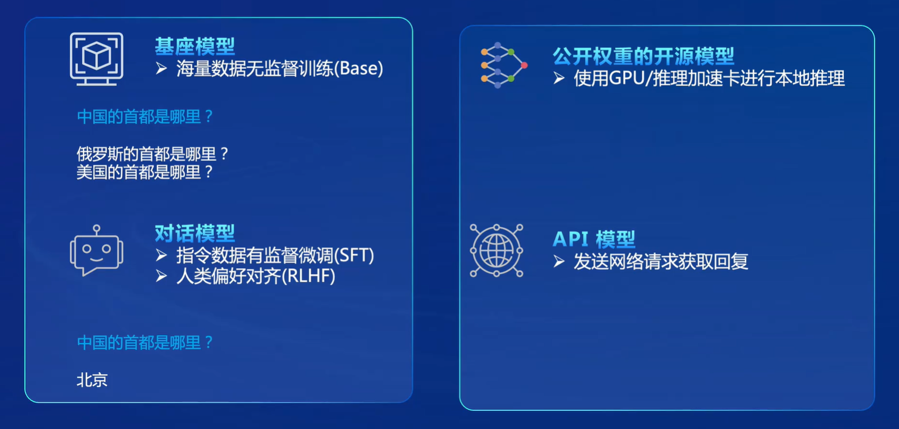

## 大语言模型评测 
- 大语言模型评测是对大型语言模型在各种语言理解任务上进行系统性评估的过程。这些任务包括但不限于语言生成、文本理解、问答、摘要生成、对话系统等。评测的目的是评估模型在不同任务上的性能、泛化能力和可用性，以便比较不同模型之间的表现，并指导模型的改进和优化。
- 评测可以帮助发现模型的优势和不足，指导模型改进和优化，推动大语言模型。可以帮助建立任务标准和性能基准，为研究和工程实践提供参考和指导。
- 面临的挑战
  - 任务多样性： 不同的应用场景和任务类型需要不同的评测方法和指标，如何全面评测大语言模型在各种任务上的性能是一个挑战。
  - 数据集质量和多样性： 数据集的选择和构建对评测结果具有重要影响，但现实中的数据集往往存在偏差和不足，如何选择合适的数据集并确保其质量和多样性是一个挑战。
  - 评价指标选择： 不同任务需要不同的评价指标，如何选择合适的评价指标并确保其准确性和可靠性是一个挑战。
  - 公平性和可比性： 评测结果应该公平、可靠且可比较，但由于模型、数据和评价指标的差异性，如何确保评测结果的公平性和可比性是一个挑战。
  - 快速迭代和更新： 大语言模型技术发展迅速，新的模型和方法不断涌现，评测需要及时更新和迭代，以反映最新的技术进展和实践需求，但如何快速迭代和更新评测是一个挑战。
## OpenCompass 
  
  
  - 如何评测大模型
    
  - CompassRank
    
  - CompassKit
    